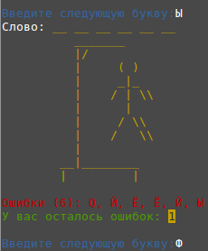
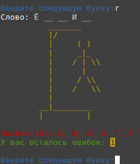

# Консольная игра "Виселица"

  

* ### Требования к системе
  * *В системе должен быть установлен [Ruby](https://www.ruby-lang.org/en/downloads/) версии 2.5 или выше* 

* ### Установка необходимых зависимостей
  * *Необходимо скачать код программы и распаковать zip-архив или склонировать репозиторий командой:*

  ```bash
     $ git clone https://github.com/USERNAME/REPOSITORY
   ```

  * *В командной строке перейти в папку где расположен файл: ```main.rb``` и запустить команду для установки 
  необходимых gem-файлов.*
  ```bash
     $ bundle install
   ```
* ### Запуск игры
  * *Для запуска игры, наберите команду:*
  ```bash
     $ bundle exec ruby main.rb
   ```
* ### Настройки программы
  * *Вы можете добавить слова для отгадывания в текстовой файл: ```data/words.txt```*
